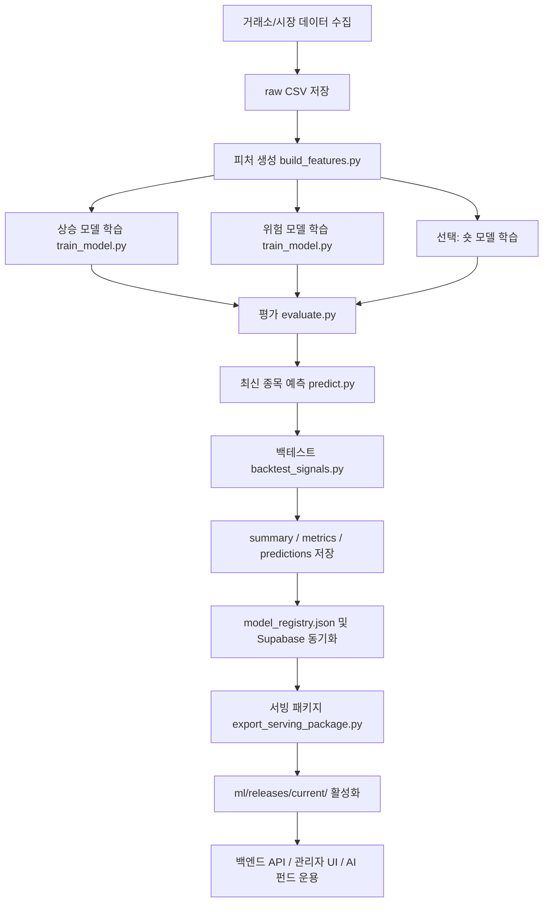

# 트레이딩 ML 파이프라인 이해 문서

이 문서는 팀원이 현재 저장소의 머신러닝 영역을 빠르게 이해하고, 데이터 수집부터 학습, 예측, 백테스트, 모델 레지스트리, 서빙 패키지, AWS 런타임 연결까지 이어지는 흐름을 추적할 수 있도록 정리한 기술 개요서입니다.

현재 구현 기준으로 ML은 주문을 직접 실행하는 모듈이 아니라 **AI 위탁/챗봇/관리자 화면이 참고하는 정량 신호를 생성하는 오프라인 파이프라인**입니다. 실제 매수·매도 실행은 백엔드의 AI 펀드 운영 서비스와 거래소 클라이언트가 담당하며, ML 산출물은 진입 후보, 위험 확률, 정책 차단 사유, 백테스트 지표를 제공합니다.

---

## 1. 한눈에 보는 전체 흐름



핵심 실행기는 `ml/src/run_pipeline_bundle.py`입니다. 이 파일이 `build_features`, `train_model`, `evaluate`, `predict`, `backtest_signals`를 순서대로 호출하고, 마지막에 요약 JSON을 생성합니다.

---

## 2. 디렉터리와 파일 역할

```text
ml/
├── configs/              모델별 YAML 설정
├── data/
│   ├── raw/              원천 캔들, 매크로, 뉴스, DART 피처 CSV
│   ├── processed/        피처 CSV, 예측 CSV, 백테스트 JSON/CSV, summary JSON
│   ├── ops/              job_history.json, model_registry.json
│   └── reference/        학습 유니버스 정의
├── models/               학습된 joblib 모델과 metrics JSON
├── reports/              실험/비교 리포트
├── releases/             로컬에서 활성화한 현재 릴리스
├── serving_packages/     EC2 업로드용 패키지 산출물
└── src/                  학습 파이프라인 소스
```

주요 소스 파일은 다음 역할을 가집니다.

| 파일 | 역할 |
| --- | --- |
| `ml/src/build_features.py` | raw 캔들을 학습 가능한 피처 테이블로 변환합니다. |
| `ml/src/train_model.py` | LightGBM 기반 상승/위험/숏 모델을 학습하고 joblib와 metrics를 저장합니다. |
| `ml/src/evaluate.py` | 저장된 모델을 기준으로 검증 지표를 계산합니다. |
| `ml/src/predict.py` | 각 심볼의 최신 피처 1행을 뽑아 예측 CSV를 생성합니다. |
| `ml/src/backtest_signals.py` | `up_only`, `composite`, `short_only` 전략을 백테스트합니다. |
| `ml/src/run_pipeline_bundle.py` | 피처 생성부터 백테스트와 summary 저장까지 한 번에 실행합니다. |
| `ml/src/export_serving_package.py` | 활성 모델을 EC2 서빙에 필요한 최소 파일 묶음으로 패키징합니다. |
| `backend/services/ml_automation_service.py` | 관리자/스케줄러가 실행할 자동화 preset을 정의합니다. |
| `backend/services/ml_model_service.py` | 모델 선택, 성능 요약, 예측 결과 보강, API 응답 구성을 담당합니다. |
| `backend/services/ml_release_service.py` | `ml/releases/current/<asset>` 릴리스의 파일 해시와 신선도를 검증합니다. |

---

## 3. 데이터 수집과 원천 파일

데이터 수집은 백엔드 스크립트와 자동화 preset에서 시작합니다.

- 주식 캔들: `backend/scripts/export_training_candles.py`가 Toss/KIS 계열 시장 데이터를 CSV로 내보냅니다.
- 코인 캔들: Binance 기반 캔들을 CSV로 내보냅니다.
- 국내 공시 피처: `backend/scripts/export_dart_features.py`가 DART 공시와 AI 분석 결과를 일자별 피처로 변환합니다.
- 뉴스 피처: `backend/scripts/export_news_features.py`가 뉴스 감성, 기사 수, 집중도, 스트레스 점수 등으로 변환합니다.
- 매크로 피처: KOSPI, KOSDAQ, NASDAQ, USD/KRW 등 시장 지표가 주식 모델에 결합됩니다.

대표 raw 파일은 다음과 같습니다.

| 파일 | 사용처 |
| --- | --- |
| `ml/data/raw/stock_candles.csv` | 통합 주식 모델 |
| `ml/data/raw/kr_stock_candles.csv` | 국내주식 shadow 모델 |
| `ml/data/raw/us_stock_candles.csv` | 해외주식 shadow 모델 |
| `ml/data/raw/crypto_candles_30m.csv` | 코인 v8/v9 계열 |
| `ml/data/raw/crypto_candles_4h.csv` | 코인 v10/v11 계열 |
| `ml/data/raw/macro_indices.csv` | 주식 매크로/시장 국면 피처 |
| `ml/data/raw/dart_features.csv` | 국내주식 공시 피처 |

---

## 4. 피처 엔지니어링

`build_features.py`는 자산군별로 공통 피처와 선택 피처를 합쳐 학습 테이블을 만듭니다. 설정 파일의 `model.feature_columns`가 최종 학습 입력 순서를 결정하므로, 모델을 새로 만들 때는 YAML의 피처 목록과 실제 생성 컬럼이 일치해야 합니다.

주요 피처 묶음은 다음과 같습니다.

| 피처 묶음 | 예시 | 목적 |
| --- | --- | --- |
| 가격/수익률 | `return_1`, `return_5`, `overnight_gap`, `intraday_return` | 단기 추세와 갭 움직임 포착 |
| 추세/평균회귀 | `ma_20_gap`, `ma_60_gap`, `reversal_strength_1` | 이동평균 대비 위치와 반전 강도 측정 |
| 변동성/리스크 | `volatility_20`, `atr_14`, `abnormal_range_ratio_20` | 급락·급등 노이즈와 손실 위험 포착 |
| 거래량/수급 | `volume_ratio_5`, `amount_zscore_20`, `obv_zscore_20` | 거래대금 집중과 수급 이상 감지 |
| 기술지표 | `rsi_14`, `stoch_k_14`, `macd_hist`, `bollinger_position_20` | 모멘텀과 과열/침체 구간 반영 |
| 시장/섹터 국면 | `market_breadth_5`, `sector_breadth_5`, `market_regime_score` | 개별 종목 신호가 시장 흐름과 맞는지 판단 |
| 코인 기준자산 | `btcusdt_return_4`, `ethusdt_return_6`, `relative_to_btc_return_6` | BTC/ETH 흐름 대비 알트코인 상대 강도 계산 |
| 뉴스/공시 | `market_news_sentiment`, `dart_risk_point_count_20d` | 이벤트성 위험과 심리 변수를 반영 |

국내주식 전용 모델은 DART 피처를 사용하고, 해외주식과 코인 모델은 DART 피처를 사용하지 않습니다.

---

## 5. 라벨과 모델 구조

현재 파이프라인은 상승 모델과 위험 모델을 분리합니다.

- 상승 모델은 `target_column`이 보통 `up_label` 또는 `residual_up_label`입니다.
- 위험 모델은 `risk_label` 또는 `residual_risk_label`을 사용합니다.
- 코인 숏 모델은 별도 `short_config`가 지정될 때 추가로 학습됩니다.
- `horizon_periods`는 예측 대상 기간입니다. 예를 들어 코인 v10은 4시간봉 기준 `6`이므로 약 24시간 뒤 움직임을 봅니다.
- `neutral_zone_abs_return`과 `drop_neutral_samples`는 애매한 수익률 구간을 학습에서 제외해 라벨 노이즈를 낮춥니다.
- `use_residual_label`은 시장 대표 심볼 또는 시장 수익률을 차감한 잔차 수익률로 알파를 학습한다는 의미입니다.

`train_model.py`는 기본적으로 `LGBMClassifier`를 사용합니다. 설정에서 `training.use_ensemble: true`이면 LightGBM 확률과 Ridge 회귀 출력을 가중 평균합니다. 현재 구현은 기본 가중치로 LightGBM `0.7`, Ridge `0.3`을 사용하며, 확률 보정이 켜져 있으면 별도 calibration 구간에서 Logistic Regression 보정기를 학습합니다.

과적합과 데이터 누수를 줄이기 위한 장치는 다음과 같습니다.

- 시간 순서 기반 train/validation split
- 선택 가능한 time-series CV
- class imbalance 보정
- 심볼별 sample weight 균형화
- scale positive weight 적용
- 별도 calibration split

---

## 6. 예측과 정책 적용

`predict.py`는 최신 피처 행을 심볼별로 1개씩 고른 뒤 상승 확률과 위험 확률을 계산합니다.

공통 출력 개념은 다음과 같습니다.

| 필드 | 의미 |
| --- | --- |
| `up_probability` | 상승 모델이 계산한 상승 확률 |
| `risk_probability` | 위험 모델이 계산한 하락/손실 위험 확률 |
| `composite_spread` | `up_probability - risk_probability` |
| `adjusted_composite_spread` | 정책 페널티와 보정을 반영한 최종 스프레드 |
| `position` | `LONG`, `HOLD`, `SHORT` 중 모델 판단 |
| `signal_score` | 화면과 랭킹에서 쓰는 최종 점수 |
| `policy_block_reason` | 매수 차단 사유 코드 |
| `recommendation_tier` | `LONG`, `WATCH` 등 추천 등급 |

주식은 `ml/src/policy_utils.py`의 `apply_stock_policy_frame`을 거쳐 시장 국면, 시장 breadth, 섹터 breadth, 위험 순위, 스프레드, 예외 진입 정책을 함께 반영합니다. 코인은 상승 확률보다 위험 확률과 스프레드를 더 강하게 보는 composite 로직을 사용합니다.

---

## 7. 현재 모델군과 상태

### 통합 주식 모델

| 항목 | 현재 기준 |
| --- | --- |
| 주요 preset | `stock-v11-full` |
| 상승 config | `ml/configs/lgbm_stock_v11.yaml` |
| 위험 config | `ml/configs/lgbm_stock_risk_v11.yaml` |
| raw 파일 | `ml/data/raw/stock_candles.csv` |
| 레지스트리 상태 | `lgbm_stock_signal_v11`이 latest/recommended/serving |
| 특징 | 통합 주식 유니버스, 시장/섹터 breadth, 정책 필터, 예외 진입 정책 |

### 국내주식 shadow 모델

| 항목 | 현재 기준 |
| --- | --- |
| 주요 preset | `kr-stock-v1-full` |
| 상승 config | `ml/configs/lgbm_kr_stock_v1.yaml` |
| 위험 config | `ml/configs/lgbm_kr_stock_risk_v1.yaml` |
| raw 파일 | `ml/data/raw/kr_stock_candles.csv` |
| 레지스트리 상태 | `lgbm_kr_stock_signal_v1`이 STOCK_KR latest/recommended/serving |
| 특징 | 국내주식 전용 유니버스, DART 공시 피처 사용 |

### 해외주식 shadow 모델

| 항목 | 현재 기준 |
| --- | --- |
| 주요 preset | `us-stock-v1-full` |
| 상승 config | `ml/configs/lgbm_us_stock_v1.yaml` |
| 위험 config | `ml/configs/lgbm_us_stock_risk_v1.yaml` |
| raw 파일 | `ml/data/raw/us_stock_candles.csv` |
| 레지스트리 상태 | `lgbm_us_stock_signal_v1`이 STOCK_US latest/recommended/serving |
| 특징 | 해외주식 전용 유니버스, DART 제외 |

### 코인 모델

| 항목 | 현재 기준 |
| --- | --- |
| 운영 점검 preset | `crypto-v10-full` |
| 테스트 preset | `crypto-v11-full` |
| 이전 30분봉 preset | `crypto-v9-full` |
| v10 상승 config | `ml/configs/lgbm_crypto_v10.yaml` |
| v10 위험 config | `ml/configs/lgbm_crypto_risk_v10.yaml` |
| v10 raw 파일 | `ml/data/raw/crypto_candles_4h.csv` |
| v10 특징 | 248종목 4시간봉, BTC 추세 필터, stop-loss 백테스트, Optuna HPO 기반 파라미터 |
| 레지스트리 주의 | `model_registry.json`에는 v10/v11이 latest로 남아 있으나 recommended/serving은 false입니다. 실제 운영 반영 전 promotion/serving 상태 확인이 필요합니다. |

코인 쪽은 문서와 코드가 과거 v9 중심 설명에서 v10/v11 실험 구조로 확장된 상태입니다. 따라서 운영 작업 시에는 반드시 `backend/services/ml_automation_service.py`, `ml/data/ops/model_registry.json`, `ml/releases/current/crypto/manifest.json` 세 곳을 함께 확인해야 합니다.

---

## 8. 자동화 preset 기준 실행 흐름

관리자 UI 또는 스케줄러가 자동화를 실행할 때의 기준 정의는 `backend/services/ml_automation_service.py`입니다.

현재 코드에 존재하는 preset은 다음과 같습니다.

| preset | 역할 |
| --- | --- |
| `stock-v7-full`, `stock-v8-full` | 과거 주식 실험/비교용 |
| `stock-v11-full` | 통합 주식 현재 기준 |
| `kr-stock-v1-full` | 국내주식 shadow 현재 기준 |
| `us-stock-v1-full` | 해외주식 shadow 현재 기준 |
| `crypto-v7-full`, `crypto-v8-full`, `crypto-v9-full` | 과거 코인 실험/비교용 |
| `crypto-v10-full` | 코인 운영 점검 기준 |
| `crypto-v11-full` | 코인 테스트 후보 |

`ml_scheduler`는 분산 락을 잡은 뒤 데이터 수집, 학습, 예측, 백테스트를 실행하고 `ml_dataset_jobs`, `ml_training_runs`, `ml_model_registry`에 best-effort로 동기화합니다. Supabase 테이블이 없거나 동기화가 실패해도 파일 기반 산출물이 1차 저장소 역할을 하도록 설계되어 있습니다.

---

## 9. 실행 예시

### 통합 주식 v11

```bash
cd ml
source .venv/bin/activate
python src/run_pipeline_bundle.py \
  --config configs/lgbm_stock_v11.yaml \
  --risk-config configs/lgbm_stock_risk_v11.yaml \
  --summary-output data/processed/stock_v11_summary.json
```

### 국내주식 shadow v1

```bash
python backend/scripts/export_dart_features.py \
  --dates-source-path ml/data/raw/kr_stock_candles.csv \
  --output ml/data/raw/dart_features.csv

cd ml
source .venv/bin/activate
python src/run_pipeline_bundle.py \
  --config configs/lgbm_kr_stock_v1.yaml \
  --risk-config configs/lgbm_kr_stock_risk_v1.yaml \
  --summary-output data/processed/kr_stock_v1_summary.json
```

### 코인 v10

```bash
cd ml
source .venv/bin/activate
python src/run_pipeline_bundle.py \
  --config configs/lgbm_crypto_v10.yaml \
  --risk-config configs/lgbm_crypto_risk_v10.yaml \
  --short-config configs/lgbm_crypto_short_v11.yaml \
  --summary-output data/processed/crypto_v10_summary.json
```

---

## 10. 산출물 계약

학습이 끝나면 다음 산출물이 생성됩니다.

| 산출물 | 예시 | 소비 주체 |
| --- | --- | --- |
| 모델 파일 | `ml/models/lgbm_stock_signal_v11.joblib` | 예측 CLI, 서빙 패키지 |
| 지표 파일 | `ml/models/lgbm_stock_signal_v11.metrics.json` | 관리자 성능 화면, manifest |
| 피처 파일 | `ml/data/processed/stock_features_lgbm_v11.csv` | 학습/예측 재현 |
| 예측 파일 | `ml/data/processed/stock_predictions_lgbm_v11.csv` | 관리자 UI, 챗봇 추천, 릴리스 스냅샷 |
| 백테스트 요약 | `ml/data/processed/*_backtest_*.json` | promotion 판단 |
| summary JSON | `ml/data/processed/*_summary.json` | 레지스트리/운영 요약 |
| 레지스트리 | `ml/data/ops/model_registry.json` | active model selection |
| 서빙 패키지 | `ml/serving_packages/<asset>-<version>/manifest.json` | EC2 배포 |

joblib payload에는 `model`, 선택적 `ridge_model`, 선택적 `calibrator`, `config`, `metrics`가 들어갑니다. 예측 시 `policy_utils.predict_with_payload`가 동일한 피처 순서와 보정기를 사용하므로, YAML과 metrics의 `feature_columns`가 런타임 계약의 핵심입니다.

---

## 11. 레지스트리와 모델 승격 기준

모델 상태는 파일 기반 `ml/data/ops/model_registry.json`이 1차 저장소이고, Supabase `ml_model_registry`는 동기화 대상입니다.

상태 플래그 의미는 다음과 같습니다.

| 플래그 | 의미 |
| --- | --- |
| `is_latest` | 가장 최근 학습 또는 등록된 버전 |
| `is_recommended` | 성능 비교상 후보로 추천된 버전 |
| `is_serving` | 실제 활성 모델 선택에 사용되는 버전 |

승격 판단 시 확인해야 할 대표 지표는 다음입니다.

- 상승 모델 ROC AUC
- 상승 모델 `precision_at_top_10pct`
- 위험 모델 ROC AUC
- 위험 모델 상위 10% precision
- composite 백테스트 순초과수익
- 최대낙폭
- 선택 종목 수와 거래 빈도
- policy block 이후에도 후보가 충분히 남는지

특히 shadow 모델은 자동으로 기존 serving을 대체하는 구조가 아니라, `promotion_candidate` 또는 recommended 상태를 만든 뒤 관리자가 성능과 리스크를 확인하고 serving 승격 여부를 결정하는 흐름으로 이해해야 합니다.

---

## 12. 서빙 패키지와 AWS 런타임

EC2에는 raw 학습 데이터 전체를 올리지 않습니다. `export_serving_package.py`가 활성 모델에 필요한 최소 파일만 복사하고 `manifest.json`을 생성합니다.

```bash
python3 -m ml.src.export_serving_package \
  --asset-key kr_stock \
  --output-root ml/serving_packages \
  --no-predictions \
  --archive
```

manifest에는 다음 정보가 들어갑니다.

- `asset_key`, `asset_type`
- `model_version`, `risk_model_version`
- `policy_version`
- `feature_columns`
- `prediction_policy`
- 성능 스냅샷
- 필수 파일 목록과 SHA-256
- 런타임 fail-closed 조건

`backend/services/ml_release_service.py`는 `ml/releases/current/<asset>`의 `manifest.json`을 읽고 필수 파일 해시를 검증합니다. 릴리스 신선도 기준은 현재 코드상 코인 12시간, 주식 36시간입니다. 코인은 `prediction_data_at`도 함께 확인합니다.

---

## 13. 백엔드 API와 화면 연결

운영 화면은 예측 CSV를 그대로 노출하지 않고, `backend/services/ml_model_service.py`에서 보강한 API 응답을 사용합니다.

대표 엔드포인트:

```text
GET /api/ml/predictions/active
```

대표 응답 필드:

| 필드 | 화면에서의 의미 |
| --- | --- |
| `signal_grade` | 사람이 읽기 쉬운 신호 등급 |
| `reason_summary` | 추천/차단 사유 요약 |
| `predicted_at` | 예측 기준 시각 |
| `staleness_minutes` | 예측 데이터 경과 시간 |
| `model_version` | 예측을 만든 모델 버전 |
| `recommendation_tier` | LONG/WATCH 등 추천 단계 |
| `policy_block_reason_labels` | 정책 차단 사유 라벨 |
| `market_breadth_5` | 시장 breadth |
| `sector_strength_score` | 섹터 강도 |
| `volume_ratio_5` | 단기 거래량 배율 |
| `adjusted_composite_spread` | 정책 반영 후 스프레드 |
| `long_entry_distance` | LONG 진입 조건까지 남은 거리 |

프론트엔드에서는 관리자 ML 화면과 종목 상세 ML 신호 패널이 이 API 결과를 사용합니다.

---

## 14. 팀원이 작업할 때 먼저 볼 파일

목적별 시작점은 다음과 같습니다.

| 하고 싶은 일 | 먼저 볼 파일 |
| --- | --- |
| 현재 자동화 preset 확인 | `backend/services/ml_automation_service.py` |
| 모델 설정/피처 목록 확인 | `ml/configs/*.yaml` |
| 피처 생성 로직 확인 | `ml/src/build_features.py` |
| 학습 방식 확인 | `ml/src/train_model.py` |
| 예측 CSV 컬럼 확인 | `ml/src/predict.py` |
| 정책 차단 로직 확인 | `ml/src/policy_utils.py` |
| 백테스트 기준 확인 | `ml/src/backtest_signals.py` |
| 활성 모델 선택 확인 | `backend/services/ml_model_service.py` |
| 릴리스 검증 확인 | `backend/services/ml_release_service.py` |
| 서빙 패키지 구성 확인 | `backend/services/ml_serving_package_service.py` |
| 현재 모델 상태 확인 | `ml/data/ops/model_registry.json` |

---

## 15. 수정 시 체크리스트

ML 코드를 바꿀 때는 아래 항목을 같이 확인해야 합니다.

- YAML의 `feature_columns`와 `build_features.py` 실제 생성 컬럼이 일치하는가?
- 상승 모델과 위험 모델의 raw/features 경로가 같은 데이터셋을 바라보는가?
- `prediction.risk_model_path`가 실제 위험 모델 joblib 경로와 맞는가?
- `run_pipeline_bundle.py` 실행 시 summary에 metrics, predictions, backtest 경로가 모두 들어가는가?
- 예측 CSV에 프론트/백엔드가 기대하는 컬럼이 빠지지 않았는가?
- `model_registry.json`의 latest/recommended/serving 상태가 의도와 맞는가?
- 서빙 패키지 manifest의 필수 파일 해시가 검증되는가?
- AWS 실행 노드는 raw 데이터가 아니라 `ml/releases/current/<asset>`만 읽는다는 전제를 깨지 않았는가?

---

## 16. 관련 문서

- `ml/README.md`: ML 디렉터리 기본 사용법
- `ml/automation_plan.md`: 자동화 설계 메모
- `ml/dataset_ops_runbook.md`: 데이터셋 운영 절차
- `ml/serving_package_runbook.md`: 서빙 패키지 운영 절차
- `ml/live_run_checklist.md`: 라이브 실행 전 점검표
- `docs/system_workflow.md`: 전체 시스템 워크플로우
- `docs/project_structure.md`: 저장소 구조 설명
